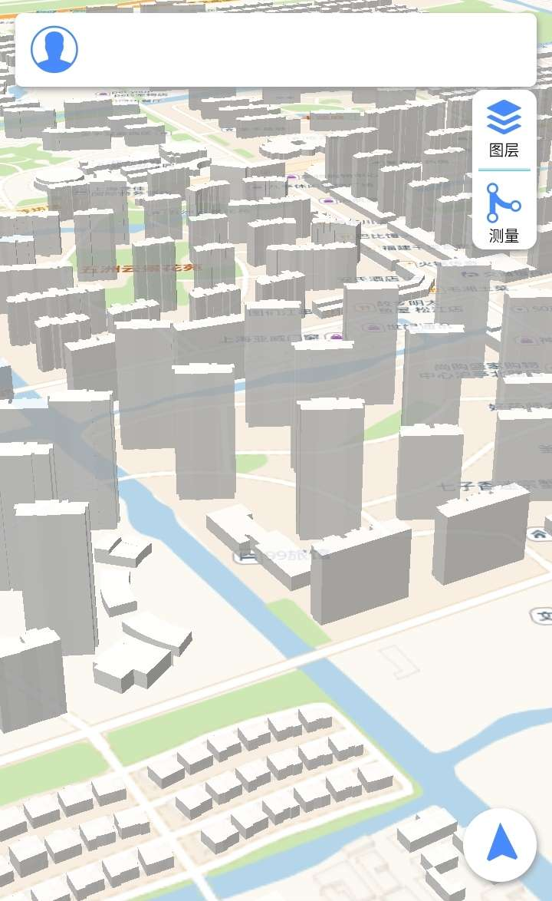

测试1：

测试1.1：

测试2：

测试4：

测试5：

测试7：
我现在写了一个段落，并且想在这个段落的某一个地方引入一张图片
测试8：

发布博客操作：
修改url
url: https://minaszy.github.io
url: http://localhost:4000
hexo clean
hexo g
hexo d

js
es6
vue
react
cesium
threejs

